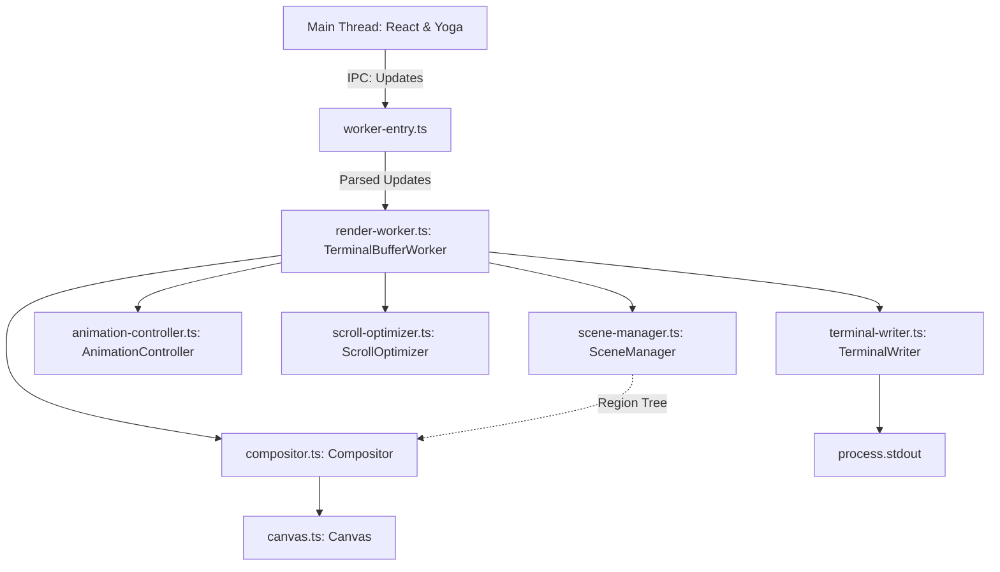

# Ink Worker Rendering Pipeline Design

## Overview
The `@src/worker/**` directory contains the modern, high-performance rendering pipeline for Ink. It runs in a separate worker process to decouple UI rendering from the main thread's layout calculations and React reconciliation. This architecture provides smooth animations, efficient scrollback management, and optimized terminal updates via line-diffing and hardware scrolling.

## Architecture

The worker pipeline consists of several key components that work together to transform a tree of UI regions into efficient ANSI escape sequences.



### Key Components

1. **`worker-entry.ts`**: The IPC entry point. It receives messages (`init`, `edits`, `render`, `fullRender`) from the main thread and forwards them to the `TerminalBufferWorker`.
2. **`render-worker.ts` (`TerminalBufferWorker`)**: The central orchestrator. It receives region updates, triggers composition, coordinates scrolling operations, and manages the primary vs. alternate terminal buffers.
3. **`scene-manager.ts` (`SceneManager`)**: Maintains the state of the UI. It stores a tree of `Region` objects, handling updates from the main thread (dimensions, scroll positions, raw line data, sticky headers).
4. **`canvas.ts` (`Canvas`)**: A 2D drawing surface for terminal characters that handles bounds checking and clipping.
5. **`compositor.ts` (`Compositor`)**: Responsible for drawing the region tree onto a `Canvas`. It handles rendering regular content lines, resolving sticky header positions (both top and bottom), and drawing scrollbars based on scroll state.
6. **`scroll-optimizer.ts` (`ScrollOptimizer`)**: Calculates when to use terminal hardware scrolling (e.g., ANSI delete/insert line codes) instead of completely redrawing the screen. It also tracks which lines need to be pushed to the backbuffer to properly preserve terminal scrollback history.
7. **`animation-controller.ts` (`AnimationController`)**: Manages smooth scrolling animations, interpolating between current and target scroll positions over time.
8. **`terminal-writer.ts` (`TerminalWriter`)**: The low-level ANSI rendering engine. It maintains internal representations of the `screen` and the `backbuffer`. It uses line-by-line diffing to only emit ANSI codes for changed characters, minimizing visual flicker. It also leverages synchronized output (`\u001B[?2026h`) if the terminal supports it.

## Rendering Pipeline

1. **Update Phase**: The main thread sends `edits` (tree structure changes, new styled characters, scroll updates). `SceneManager` applies these to the region tree. If animated scrolling is enabled, `AnimationController` intercepts scroll targets.
2. **Scroll Optimization**: `ScrollOptimizer` calculates if regions can simply be shifted using ANSI scroll regions, saving rendering time and properly pushing scrolled-out content into the terminal's native backbuffer.
3. **Composition**: `Compositor` traverses the visible regions and draws characters onto a fixed-size `Canvas` representing the viewport.
4. **Writing**: `TerminalWriter` compares the newly composed `Canvas` against its internal `screen` buffer and emits the minimal ANSI escape sequences needed to update the physical terminal.

## Debugging with the Viewer

Debugging complex terminal layouts, z-indexes, clipping, and scrolling can be difficult when looking at raw ANSI escapes. The `@tools/viewer/**` and replay tools provide a way to record render states and step through them offline.

### Recording a Session

You can record a test or example by accessing the `internalTerminalBuffer` from a ref and calling `startRecording`.

```tsx
// tools/viewer/record-test.tsx
import { render, Box, Text } from 'ink';
import React, { useEffect, useRef } from 'react';

function App() {
    const ref = useRef<any>(null);

    useEffect(() => {
        const tb = ref.current?.parentNode?.internalTerminalBuffer;
        if (tb) {
            // Start recording a sequence of frames
            tb.startRecording('sequence');
            
            setTimeout(() => {
                // Stop and save to replay.json
                tb.stopRecording('test-replay.json');
                process.exit(0);
            }, 1000);
        }
    }, []);

    return <Box ref={ref}><Text>Hello World</Text></Box>;
}
```

This dumps the exact `RegionNode` trees and `RegionUpdate` payloads sent from the main thread into a `test-replay.json` file.

### Replaying and Inspecting

Once you have a `replay.json` file, you can use the Viewer CLI to step through the frames interactively. The viewer loads the worker out-of-process and feeds it the recorded frames, allowing you to visually inspect the output without React/Yoga running.

```bash
npx tsx tools/viewer/viewer.ts test-replay.json
```

**Viewer Controls:**
- **Sequence Replays** (multiple frames over time):
  - `Space` / `Right Arrow`: Advance to the next frame.
  - `Left Arrow`: Rewind to the previous frame (this re-simulates the worker state from the start).
- **Single Frame Replays**:
  - `Up` / `Down`: Scroll the scrollable region by 1 line (Hold `Shift` for 10 lines).
  - `PageUp` / `PageDown` (or `W`/`S`): Scroll by 100 lines.
- `Ctrl+C`: Exit.

**Flags:**
- `--debugRainbow`: Enables a rainbow mode where every frame is rendered with a different background color. Extremely useful for visualizing which areas of the screen are actually being updated by `TerminalWriter` vs. being skipped because they didn't change.
- `--no-animatedScroll`: Disables smooth scrolling if you want to inspect instant jumps.

### Human-Readable Dumps

Sometimes you need to inspect the raw data being passed to the worker. `replay.json` contains base64 encoded binary data (serialized via `serialization.ts`). You can generate a human-readable text dump to inspect the lines and structure:

```bash
npx tsx src/worker/dump-replay.ts test-replay.json
```

This generates `test-replay.json.dump.txt` which converts the base64 chunks back into arrays of styled strings, making it easy to grep for specific content, check scroll bounds, or verify sticky header states without parsing binary data.
